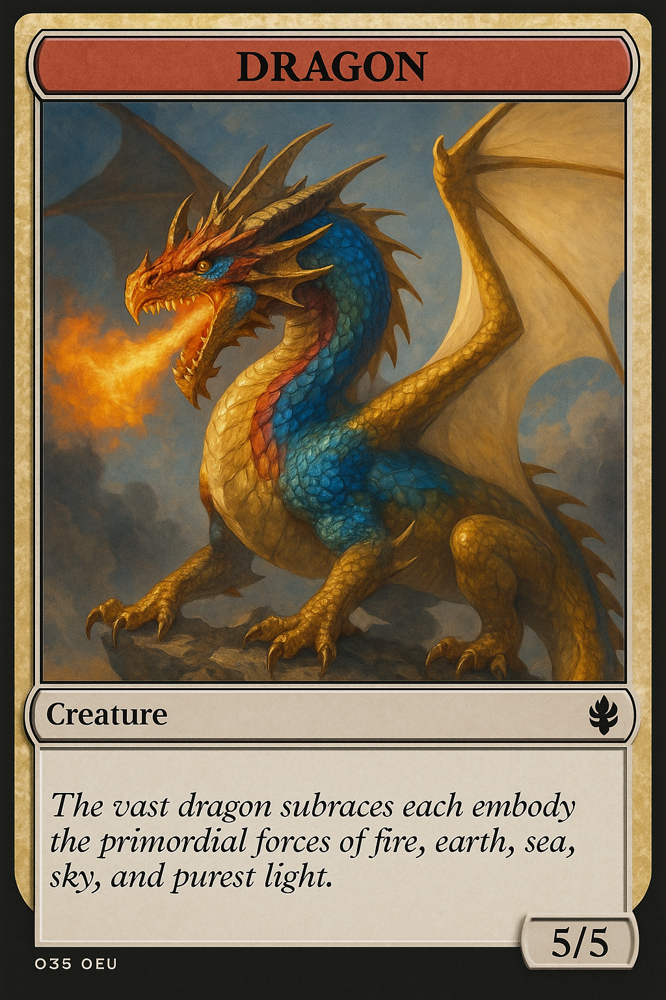

# Project RPG | Memory Battle Game

(Developer: Leon Freeman)

[Live webpage](https://leon4721.github.io/Project-RPG/)

---

## Table of Content

1. [Project Goals](#project-goals)  
   1. [User Goals](#user-goals)  
   2. [Site Owner Goals](#site-owner-goals)  
2. [User Experience](#user-experience)  
   1. [Target Audience](#target-audience)  
   2. [User Requirements and Expectations](#user-requirements-and-expectations)  
   3. [User Stories](#user-stories)  
3. [Design](#design)  
   1. [Design Choices](#design-choices)  
   2. [Colour](#colour)  
   3. [Fonts](#fonts)  
   4. [Structure](#structure)  
   5. [Wireframes](#wireframes)  
4. [Technologies Used](#technologies-used)  
   1. [Languages](#languages)  
   2. [Frameworks & Tools](#frameworks--tools)  
5. [Features](#features)  
6. [Testing](#testing)  
   1. [HTML Validation](#html-validation)  
   2. [CSS Validation](#css-validation)  
   3. [Accessibility](#accessibility)  
   4. [Performance](#performance)  
   5. [Device Testing](#device-testing)  
   6. [Browser Compatibility](#browser-compatibility)  
   7. [Testing User Stories](#testing-user-stories)  
7. [Bugs](#bugs)  
8. [Deployment](#deployment)  
9. [Credits](#credits)  
10. [Acknowledgements](#acknowledgements)  

---

## Rationale

**Project RPG** is a browser-based memory battle game where players choose a hero, face a series of increasingly powerful monsters, and advance through story-driven encounters. The goal is to train memory, reaction, and strategy skills in a fun RPG format.  

This project was inspired by classic fantasy role-playing adventures combined with the mechanics of pattern recognition games (similar to *Simon Says*). By blending **interactive storytelling**, **dynamic battles**, and **accessible gameplay**, it creates a light but immersive experience for both casual players and RPG fans.

Unlike generic memory games, Project RPG integrates:
- **Character selection** with portraits and stats,  
- **Monster battles** with unique abilities and health,  
- **Difficulty modes** (Easy, Medium, Hard),  
- **Dynamic story cutscenes**,  
- **High score saving** via `localStorage`.

---

## Project Vision & Inspiration

The game builds on the love of **fantasy RPGs** and **tabletop adventures like Dungeons & Dragons**. Leon, the developer, wanted to combine interactive storytelling with accessible browser-based play.

Key inspirations:
- D&D campaign battles with story beats at milestones.  
- RPG tropes (heroes, goblins, orcs, dragons).  
- Classic memory/pattern games adapted with RPG visuals.  

The result: a **fun, lightweight RPG memory trainer** with a branching narrative and replayability through difficulty levels.

---

## Project Goals

### User Goals
- Play an engaging fantasy game directly in the browser.  
- Choose a hero (male knight or female archer).  
- Progress through levels of monsters (Goblin → Orc → Dark Mage → Skeleton Knight → Dragon).  
- Experience branching story choices and immersive fantasy scenes.  
- Track their score and compare against previous high scores.  

### Site Owner Goals
- Demonstrate advanced web application development (HTML, CSS, JavaScript modules).  
- Create an accessible, responsive, and interactive browser game.  
- Showcase interactive storytelling combined with functional gameplay mechanics.  
- Provide replay value through difficulty modes and high score persistence.  

---

## User Experience

### Target Audience
- Casual gamers looking for quick browser-based fun.  
- RPG and fantasy fans interested in story-driven games.  
- Students/players who enjoy memory and brain-training games.  
- Anyone wanting a light, visually appealing, and accessible game.  

### User Requirements & Expectations
- Simple and intuitive gameplay (pattern matching).  
- Clear feedback on success/failure.  
- Storytelling moments between battles.  
- Responsive design for mobile, tablet, and desktop.  
- Accessibility through keyboard controls (1–4 for attacks).  

### User Stories

**First-time User**
1. I want to choose a character so I feel part of the story.  
2. I want to learn how to play easily (help modal).  
3. I want clear feedback when I win or lose a round.  

**Returning User**
4. I want to play on harder modes for more challenge.  
5. I want my high scores saved so I can try to beat them.  
6. I want to retry a level without starting over.  

**Site Owner**
7. I want the game to be responsive across devices.  
8. I want accessible modals for help and story events.  
9. I want branching story paths to add replay value.  

---

## Design

### Design Choices
- Dark fantasy theme with gold highlights.  
- Strong card-based layout for characters and monsters.  
- Floating action buttons for **help** and **contact**.  
- Modals for story, help, and instructions.  

### Colour
- Background: Dark grey/black for immersion.  
- Accents: Gold (`#ffcc00`) for fantasy/RPG style.  
- Health bars: Green (player) and Red/Orange (monsters).  

### Fonts
- Sans-serif (Segoe UI, Tahoma, Verdana).  
- High readability while maintaining fantasy aesthetics.  

### Structure
- **Index.html** → Character select + difficulty modal.  
- **Game.html** → Main battle screen, help modal, story modal.  
- **Contact.html** → Feedback form.  
- **404.html** → Themed 404 page with RPG humour.  

### Wireframes
Wireframes were created for **index, game, contact, and 404 pages** to ensure usability and flow.

---

## Technologies Used

### Languages
- HTML5  
- CSS3  
- JavaScript (ES6 modules)  

### Frameworks & Tools
- Custom CSS + modular stylesheets (`style.css`, `style2.css`, `fit.css`, `help.css`).  
- FontAwesome (icons).  
- Git & GitHub for version control.  
- GitHub Pages for deployment.  
- WAVE & Lighthouse for accessibility/performance testing.  

---

## Features

- **Character Selection** (Knight or Archer with stats).  
- **Difficulty Modes** (Easy, Medium, Hard).  
- **Monster Battles** (Goblin → Orc → Dark Mage → Skeleton Knight → Dragon).  
- **Story Beats** (cutscenes after Lv2, Lv3, Lv4, victory/defeat).  
- **Health & Score System** (HP bars, streaks, high scores).  
- **Help Modal** (compact “?” button with instructions).  
- **Fit-to-Screen Scaling** (auto resizes game container).  
- **High Scores Table** (localStorage persistence).  
- **Cheat Code** (`/Elias` → instant level clear).  
- **404 Page** (RPG-themed with dragon graphic).  
- **Contact Form** (user feedback & suggestions).  

---

## Testing

### HTML Validation
- All pages validated with [W3C HTML Validator](https://validator.w3.org/).  

### CSS Validation
- All CSS validated, minor warnings only.  

### Accessibility
- Tested with **WAVE** and keyboard-only navigation.  
- Modals trap focus and close on Escape.  

### Performance
- Lighthouse tests show fast performance due to lightweight assets.  

### Device Testing
- Tested on: iPhone, iPad, Samsung Galaxy, Windows PC, MacBook.  
- Responsive at breakpoints: 320px, 768px, 1024px, 1500px, 2000px.  

### Browser Compatibility
- Chrome, Firefox, Edge, Safari tested.  

### Testing User Stories
- First-time users can select characters and start a battle.  
- Returning users can replay patterns, switch difficulty, and track high scores.  
- Site owner goals (responsiveness, accessibility) confirmed.  

---

## Bugs

- **Duplicate help.js inclusion** (fixed by removing one script tag).  
- **Player portrait missing alt text** (fixed with dynamic alt).  
- **Return button in contact page failed when direct access** (fixed with fallback link).  

---

## Deployment

The site is deployed via **GitHub Pages**:  
👉 [Live Game Link](/)  

Steps:  
1. Push project to GitHub.  
2. In repository → Settings → Pages → Source = `main` branch.  
3. Save and publish → get live site link.  

---

## Credits

### Images & Media
- Character & monster art generated by Sora AI (Leon’s creations).  
- Additional fantasy assets from free resources (Pngtree, Pixabay).  

### Code
- All JavaScript modules authored by Leon Freeman.  
- Inspiration for scaling logic from community tutorials (fit-to-screen).  

### Fonts & Icons
- Google system fonts (Segoe UI, Tahoma, Verdana).  
- FontAwesome icons.  

---

## Acknowledgements
- Thanks to my wife and kids for their patience during development.  
- Gratitude to classmates and mentors for testing and feedback.  
- Inspired by **Dungeons & Dragons** storytelling and fantasy RPGs.  

---
