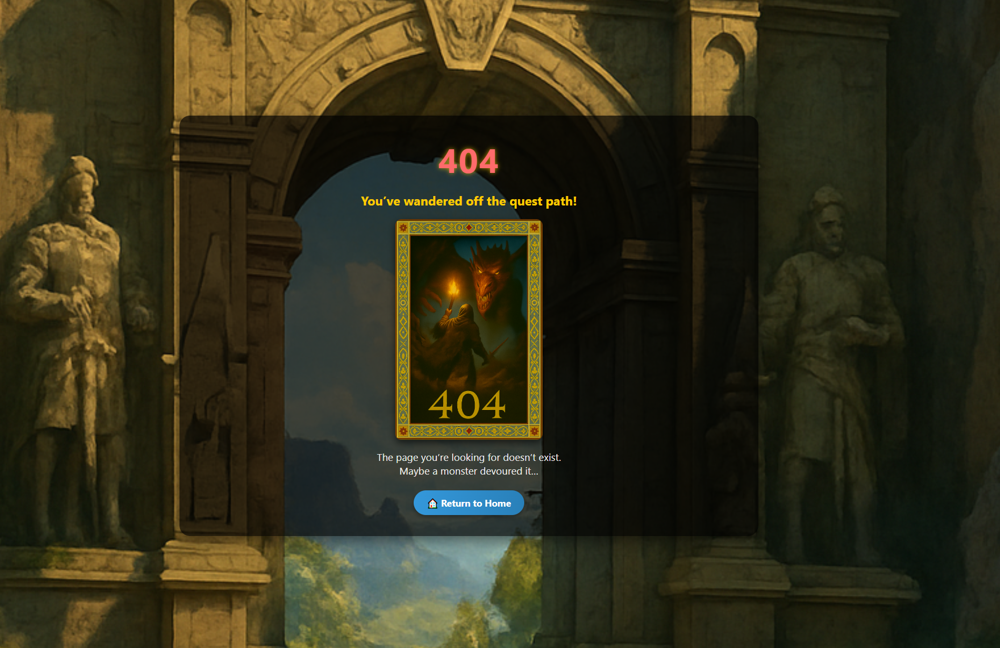
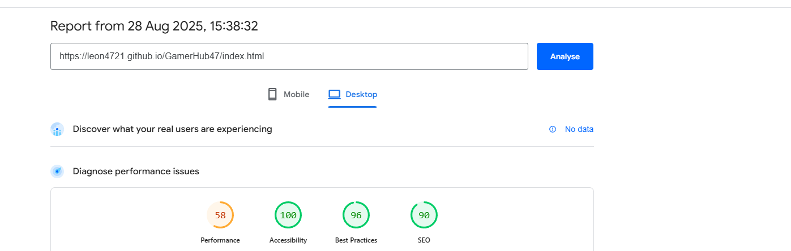

# Project two  

# Rythm and Sigil RPG | Memory Battle Game  

(Developer: Leon Freeman)  

  

[Live Webpage](https://leon4721.github.io/GamerHub47/)  

---

## Table of Contents  

1. [Project Goals](#project-goals)  
   1. [User Goals](#user-goals)  
   2. [Site Owner Goals](#site-owner-goals)  
2. [User Experience](#user-experience)  
   1. [Target Audience](#target-audience)  
   2. [User Requirements & Expectations](#user-requirements--expectations)  
   3. [User Stories](#user-stories)  
3. [Design](#design)  
   1. [Colour Scheme](#colour-scheme)  
   2. [Fonts](#fonts)  
   3. [Structure](#structure)  
   4. [Wireframes](#wireframes)  
4. [Technologies Used](#technologies-used)  
   1. [Languages](#languages)  
   2. [Frameworks, Libraries & Tools](#frameworks-libraries--tools)  
5. [Features](#features)  
6. [Validation](#validation)  
   1. [HTML Validation](#html-validation)  
   2. [CSS Validation](#css-validation)  
   3. [JavaScript Validation](#javascript-validation)  
   4. [Accessibility](#accessibility)  
   5. [Performance](#performance)  
7. [Testing](#testing)  
   1. [Device Testing](#device-testing)  
   2. [Browser Compatibility](#browser-compatibility)  
   3. [Testing User Stories](#testing-user-stories)  
8. [Bugs](#bugs)  
9. [Deployment](#deployment)  
10. [Credits](#credits)  
11. [Acknowledgements](#acknowledgements)  

---
Project Rationale – Rhythm & Sigil

Developed by CD Projekt Noir

Introduction

Rhythm & Sigil is an interactive RPG-inspired memory battle game that fuses the mechanics of rhythm and pattern recall with the immersive storytelling of fantasy role-playing games. Drawing creative influence from Baldur’s Gate 3, Skyrim, Elden Ring and RuneScape, the game distills the essence of large-scale RPG combat into a streamlined, accessible browser experience.

The project was conceived as both a creative homage to the RPG genre and a personal exploration of inclusivity within fantasy storytelling. Too often, fantasy worlds underrepresent minority groups or present them in narrow ways. Rhythm & Sigil addresses this gap by featuring a diverse cast of heroes, including strong representation of POC characters, so that players of different cultural backgrounds can see themselves reflected in a genre that has historically lacked this inclusivity.

This approach ensures that the game is not only fun and immersive but also socially meaningful — a reminder that fantasy worlds should be as diverse as the real one.

## Game Lore

At the start of Rhythm & Sigil, the player steps into the role of a chosen hero. As Galihad, the male Knight, your bride-to-be has been stolen by goblin raiders. As Eva, the female Elf warrior, it is your tribal sister who has been taken. What begins as a personal rescue quickly reveals a deeper evil at work.

The goblins are not acting alone—they serve a cunning Dark Mage, whose forbidden sorcery binds both goblins and orcs to her will. Each battle draws you closer to her fortress, where illusions and traps mask the true scale of her corruption. What feels like a rescue mission becomes a desperate fight against spreading darkness.

From facing endless waves of goblins, to dueling orc warlords, the journey culminates in a confrontation with the dreaded Skeleton Knight, a fallen champion reanimated by necromancy. Defeating him reveals the Mage’s ultimate weapon—an ancient dragon, a living force of elemental fire and destruction.

This unfolding narrative transforms a simple quest of love and loyalty into a true RPG epic, where the player discovers that every choice carries weight, every victory uncovers hidden truths, and only courage can overcome the rising tide of shadow.

## Project Goals  

The goal of "R & S" is to build a **fantasy-themed memory game** that is:  
- Engaging, story-driven, and visually immersive.  
- Accessible and responsive across modern devices.  
- Educational in the sense of memory training, while entertaining through story driven battles.  

### User Goals  
- Play a quick and fun RPG game with clear rules.  
- Progress through multiple levels and monsters.  
- Choose a hero and difficulty level.  
- Track personal high scores across play sessions.  
- Access the game on desktop, tablet, and mobile.  

### Site Owner Goals  
- Demonstrate strong web development skills (HTML, CSS, JS modules).  
- Deliver a professional, polished, and accessible product.  
- Ensure replay value through **branching storylines** and difficulty modes.  
- Provide direct contact and feedback opportunities.  
- Offer a 404 page for broken links to maintain user flow.  

---

## User Experience  

### Target Audience  
- Casual players who enjoy **quick browser games**.  
- Fans of **fantasy RPGs** and storytelling.  
- Players who enjoy **pattern recognition and memory challenges**.  
- Students or educators looking for a **fun brain-training activity**.  

### User Requirements & Expectations  
- Rules explained quickly and clearly.  
- Smooth, responsive experience across devices.  
- Clear feedback on actions (damage, healing, defeat, victory).  
- Accessibility via both **mouse click and keyboard controls**.  
- Options for replaying and difficulty choice.  

### User Stories  

#### Site User  
- I want to choose a hero and difficulty mode before starting.  
- I want to understand how to play using a help modal.  
- I want clear health bars and scores so I can track progress.  
- I want immersive story cutscenes to feel invested.  
- I want my high scores saved so I can try to beat them.    
- I want to play on mobile, tablet, and desktop.  
- I want to contact the developer for support or feedback.  

#### Site Owner  
- I want players to find the game easy to learn but challenging to master.  
- I want to provide an engaging narrative to enhance replayability.  
- I want all code validated and error-free.  
- I want to demonstrate accessibility and performance best practice.  
- I want a 404 error page instead of browser default.  

---

## Design  

### Colour Scheme  
We chose a dark-fantasy base with gold accents because it echoes classic RPG visual language: torchlit dungeons, treasure glint, “legendary” rarity frames. Green for player HP and red/orange for enemy damage mirrors D&D, Diablo, Baldur’s Gate, and MMO HUDs. Blue (arcane/mage), purple (archer/BeastMastery), red (warrior/strength), and Green (healer/druid) map to long-standing class color conventions, so actions are instantly readable—even for players coming from rhythm/improv memory games like Simon. High-contrast grey highlights call out each pattern without confusion. The palette also meets accessibility needs (contrast and label redundancy), keeping the screen legible on small devices while preserving an RPG atmosphere.

The Color Pallet used was made on [adobe.com](https://color.adobe.com/create/color-wheel/)

- **Dark fantasy palette** with gold highlights.  
- Player HP: green gradient.  
- Monster HP: red/orange gradient.  
- Modal backgrounds: semi-transparent black for immersion.  
- Accent gold (#ffcc00) for buttons and key highlights.  

### Fonts  
- `Segoe UI` for clean readability.  
- Bold headings with fantasy feel using strong shadows.  

### Structure  
The website consists of 4 main pages:  
1. **Index Page** – Character selection and difficulty modal.  
2. **Game Page** – Main battle screen, help modal, and story modal.  
3. **Contact Page** – Feedback form with validation.  
4. **404 Page** – Fantasy-themed error page with return link.
  
The site is organised so players can learn fast and move smoothly between key views. Core UI patterns (title area, HUD, action strip, floating help/contact) remain consistent to reduce cognitive load.

Screens & overlays included:

Title / Character Select
Players enter a hero name, browse character cards, and start their journey. The page also exposes quick audio controls and a floating contact link. A shared Story overlay can appear here after selection to set the scene.

Main Battle
The playfield displays a compact HUD with Level/Mode (circular badge) plus Round/Score, flanked by matching Player and Monster frames with semantic health bars. Primary controls (Start Battle and Replay Pattern) sit above a 2×2 action grid (Archer/Mage/Warrior/Healer) with printed key hints (1–4). A floating “?” opens the How-to-Play dialog; Story scenes can also overlay between levels. A persistent Contact button is available.

How-to-Play (modal overlay)
Available on the battle screen via the “?” button, this modal explains the sequence/response loop, keyboard controls, healing rules, and tips. It supports Esc to close, backdrop click, and focus return for accessibility.

Story (modal overlay)
Narrative cards (image, text, choice buttons) punctuate progression—after levels, at forks, on victory/defeat—and are shared between the title and game pages for consistency.

Contact
A dedicated page provides a styled form with client validation, a honeypot field, polite status updates, a confirm/error modal, and a smart Return action (back or home). EmailJS integration is wired for sending.

404 Error Page
A themed not-found screen keeps players inside the experience and offers a clear route back to the Home page. 

Shared elements across screens:

Top audio controls for SFX and music (toggle states, visible slash when music is off).

Responsive container sizing and aspect-ratio cards to keep all critical UI on-screen on mobile without scrolling.

This structure keeps navigation predictable: players start at Character Select, battle through the Main screen with help/story overlays as needed, reach out via Contact if required, and land on a friendly 404 if they stray.

### Wireframes  
Wireframes were produced in **Balsamiq** for:  PC , Ipad Pro , and Iphone SE

- 

Index / Character Selection

- 

Game

- 

Difficulty settings

- 

Story Pop-Ups

- 

Contact Us

- 

How to Play

  
---

## Technologies Used

### Languages & Core APIs
- **HTML5** — semantic structure, modal markup, forms.
- **CSS3** — responsive layout (Flexbox/Grid), media queries, transitions.
- **JavaScript (ES6+)** — game logic, event handling, DOM updates.
- **Web Storage (localStorage)** — persist name, character, audio/music, first-visit flag.
- **HTML5 Audio API** — sound effects/music playback and toggles.

### Libraries & Services
- **EmailJS** — client-side email delivery for the Contact form (with success/fail handling).
- **Font Awesome (CDN)** — iconography (e.g., help “?” icon, UI controls).

### Tooling & Hosting
- **Git + GitHub** — version control and collaboration.
- **GitHub Pages** — static site hosting and deployment.
- **Chrome DevTools** — performance/viewport testing and debugging.

### Accessibility & Quality
- **ARIA attributes & keyboard support** — accessible toggles, focus states, and modal behavior.
- **WCAG-aligned color semantics** — HP/status bars with meaningful colors.
- **Validation & Testing** — HTML/CSS validation and cross-device/browser checks.

### Assets
- **Raster images (PNG/JPG) & SVG** — portraits, UI icons, and decorative graphics.

### Frameworks, Libraries & Tools  
- [Am I Responsive](http://ami.responsivedesign.is/) was used to create the multi-device mock-up you can see at the start of this README.md file.
- [Balsamiq](https://balsamiq.com/) to create the wireframes for the project
- [Bootstrap v5.1.3](https://getbootstrap.com/)
- [EmailJS](https://www.emailjs.com) used to send email from the contact form
- [Favicon.io](https://favicon.io) for making the site favicon
- [Font Awesome](https://fontawesome.com/) - Icons from Font Awesome were used throughout the site
- [Git](https://git-scm.com/) was used for version control within VSCode to push the code to GitHub
- [GitHub](https://github.com/) was used as a remote repository to store project code
- [Google Fonts](https://fonts.google.com/)
- [adobe](https://color.adobe.com/create/color-wheel) was used to for color wheels and design. 
- [Chrome dev tools](https://developers.google.com/web/tools/chrome-devtools) were used for debugging of the code and check site for responsiveness
- [WC3 Validator](https://validator.w3.org/), [Jigsaw W3 Validator](https://jigsaw.w3.org/css-validator/), [JShint](https://jshint.com/), [Wave Validator](https://wave.webaim.org/), [Lighthouse](https://developers.google.com/web/tools/lighthouse/) and [Am I Responsive](http://ami.responsivedesign.is/) were all used to validate the website

---

## Features  

- **Name Entry & Character Selection**  
  Players begin by entering their name and choosing a hero.   
 
- 

Character Selection

---

- **Difficulty Modes**  
  Three levels of challenge are available:  
  - **Easy**: A gentle introduction with slower sequences for first-time players.  
  - **Medium**: Faster pace with longer memory chains, adding pressure.  
  - **Hard**: Demands precision and endurance, with rapid cues and complex patterns.  
  Each round escalates in difficulty, creating an RPG-style sense of progression.  

    

---

- **Controls**  
  Two core controls guide the flow of the game:  
  - *Start Battle* begins each new sequence.  
  - *Replay Pattern* allows the user to replay the current sequence before attempting it.  
  These controls make the game accessible, especially for beginners learning the rhythm.  

    

---

- **Four Actions**  
  The game uses four RPG-inspired actions: **Archer, Mage, Warrior, and Healer**.  
  - Each action has a large touch button, designed for mobile and tablet players.  
  - Keyboard shortcuts (**1–4**) mirror the actions, ensuring cross-platform accessibility.  

    

---

- **Highlight on Cues**  
  Visual highlights appear on action buttons when a cue is triggered. Repeated cues are handled clearly, ensuring no ambiguity when buttons repeat in a sequence. This enhances fairness and user confidence during gameplay.  

    

---

- **HUD (Heads-Up Display)**  
  The HUD displays essential game information:  
  - Current **Level/Mode**  
  - **Round number**  
  - **Score tracker**  
  - **Hero and Enemy HP bars**, with semantic colors (green = healthy, yellow = warning, red = critical)  
  This ensures players always know their status at a glance.  

    

---

- **How-to-Play Modal**  
  A tutorial modal explains the rules and controls:  
  - Opens automatically on the first visit.  
  - Accessible anytime via the “?” button.  
  - Provides clear, step-by-step instructions with visual cues.  
  This ensures the game is beginner-friendly while supporting replayability.  

    

---

- **Audio & Music Toggles**  
  Players can toggle **Sound Effects** and **Background Music** independently.  
  - Icon states change to show whether audio is on or off.  
  - Preferences are saved in **localStorage**, so settings persist between sessions.  
  This gives users control over immersion without disrupting gameplay.  

    

---

- **Contact Page**  
  A fully styled form lets players send feedback or queries.  
  - Fields for **name, email, and message**.  
  - Integrated with **EmailJS** for message delivery.  
  - Displays **submission confirmation**, reassuring players their message was sent.  
  Designed to be responsive and accessible.  

    

---

- **Custom 404 Page**  
  An RPG-themed error page keeps immersion intact if users reach a non-existent link.  
  - Features fantasy artwork (hero vs dragon).  
  - Provides a **clear route back to the Home page**.  
  This prevents confusion and ensures users remain within the RPG experience.  

    

---

- **Cheat Code**  
  A hidden cheat code (`/Elias`) allows level skipping.  
  - Implemented as a developer testing tool.  
  - Useful for quickly checking later story cutscenes and difficulty progression.  
  While not part of normal gameplay, it demonstrates robust debugging and testing support.  

    

---

## Validation  

### HTML Validation  
- All pages validated with W3C Markup Validation Service.  
- No errors on custom code; minor warnings only from third-party CDNs.  

  
Index

  

  
Game

  

  
Contact

  

 

  
404

  

### CSS Validation  
- Passed W3C Jigsaw CSS Validator.  
- Only warnings related to vendor prefixes.  

  
Style

  

  
Style 2

  

  
Help

  

  
Fit

  

### JavaScript Validation  
- Scripts tested with **JSHint**.  
- No major issues found; code uses ES6 modules cleanly.  

### Accessibility  
- Tested with WAVE → 0 errors.  
- Modals close on Escape and trap focus correctly.  
- Keyboard shortcuts (1–4) for accessibility.  

  
Index

  

  
Game

  

  
Contact

  

  
404

  

### Performance  
- Lighthouse tested.  
  
  

  
Index

  

  

  
Game

  

  

  
Contact

  

  
404

  

---

## Testing  

### Device Testing  
Tested using Chrome DevTools and real devices:  
- iPhone SE, iPhone 15, Samsung Galaxy S21, iPad Pro.  
- Windows 10 (Chrome/Edge/Firefox).  
- MacBook Air (Safari).  

### Browser Compatibility  
- Google Chrome ✔  
- Mozilla Firefox ✔  
- Microsoft Edge ✔  
- Safari ✔  

## Testing User Stories

### Site User

| User Story | Feature | Action | Expected Result | Actual Result | Screenshot |  
|------------|---------|--------|----------------|---------------|------------|  
| Understand rules | Help Modal | Click `?` button | Instructions popup appears | Works | |  
| Choose hero | Character Select | Click card | Character highlighted | Works |  |  
| Choose difficulty | Difficulty Select | Pick Easy/Normal/Hard | Mode is highlighted and stored | Works |  |  
| Track progress | HUD (HP bars, Score, Level) | Start a battle | HP bars update; score & round increment | Works ||  
| Feel invested | Story Cutscenes | Reach story milestone | Narrative modal with text & image appears | Works | |   
| Retry level | Defeat popup | Click `Retry` | Restart same level | Works |  |  
| Mobile friendly | Responsive Layout | Open on phone/tablet/desktop | Layout adapts, touch targets usable | Works | |  
| Contact developer | Contact Form (EmailJS) | Submit form | Confirmation shown & email sent | work|  |  
| Audio control | Audio & Music Toggles | Toggle icons | States persist, ARIA updated | Works | |  
| Custom 404 | `/404.html` | Visit invalid route | Branded 404 page with link home | Works | |
| Replay pattern | Controls | Click `Replay Pattern` | Pattern replays correctly | Works |  |    

---

## Bugs  

| Bug | Fix |  
|-----|-----|  
| Help.js loaded twice in `game.html` | Removed duplicate `<script>` tag |  
| Player portrait alt text missing | Added dynamic alt with hero name |  
| Contact return button failed when opened directly | Added fallback to `index.html` |  
| Scaling issue on iPhone SE | Added `fit.js` auto-scaler |  
| Monster images not displaying on certain levels | Corrected typo in image path |  

---

## Deployment  

### GitHub Pages  
The project was deployed via GitHub Pages:  
1. Go to repository → Settings → Pages.  
2. Select branch `main`.  
3. Site published at: [Project RPG Live](https://leon4721.github.io/Project-RPG/).  

### Forking Repository  
1. Navigate to repo → click **Fork**.  
2. Mak
